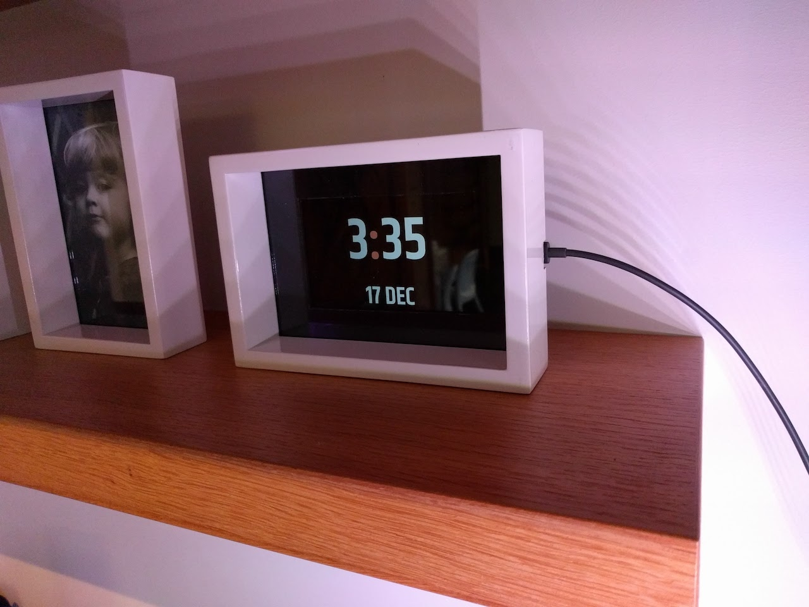
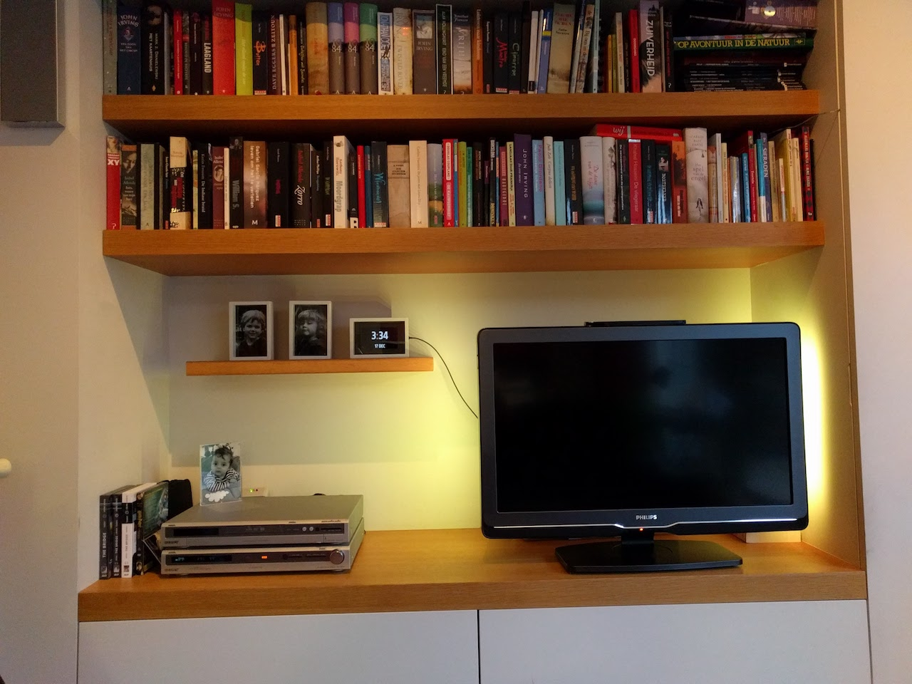

# Clock with reminders


This html clock features a clock (duh!), a weather service and reminders.
I use it on an old Nexus 4 smartphone, build into a small photo frame.

It's in the living room, as a 'smartclock':







####Reminders
A reminder has a label, a username, a color, a triggerDate and a frequency.
If a reminder gets triggered, the label is shown on the clock in the color of the user.

To dismiss the reminder, one have to click on it. This can be done on every client, since it will send the event to all clients over socket.
I'm running a client on my phone and my laptop, so there's always a client in the neighbourhood.
If a reminder has a frequency of daily, weekly or hourly, the next trigger date is increased by a day/week/hour

##Raspberry PI
Used to run the nodejs server.

##Node.js
Used to run the socket server.

##PM2
Runs tasks on the PI and keeps them alive, even after reboot of the PI.
Used to keep the node.js server alive.

##Socket.io
This is used to
- send messages over socket from the server (nodejs) to all the clients: to update the reminders.
- send messages over socket from a client to resume active reminder popups.

##Reminders storage
Wunderlist was first used to maintain the reminders.
But then I was stuck with the socket features that the API has: I never achieved to have it running. Documentation is unexisting, so I had to abandon this idea and replace it with my own reminder 'database'.
The result is a *very* simple method: reading/writing to a json file ;-)
Here's an example:
```
[
   {
     "id":"1",
     "user":"Gert",
     "label":"Pillen",
     "color":"#ff6c4e",
     "triggerDate":"2017/01/13 19:00",
     "frequency":"daily",
     "done":"false"
   },
   {
     "id":"2",
     "user":"Bas",
     "label":"huiswerk",
     "color":"red",
     "triggerDate":"2017/01/13 14:00",
     "frequency":"weekly",
     "done":"false"
   }
 ]
 ```
For now I have to manually add new reminders in the file, but of what I really need is a good UI to edit it from the clock.
Or may be I still try to implement an existing Tasks app with a good API. Too bad Google Keep does not release its API.
Any ideas are welcome!

##set up globally accessible domain for the PI
- at https://my.noip.com, make an account for a dynDNS. This will link a domain to the router
- on the TP-link router:
  * Forwarding > DMZ : add local ip address of the PI
  * Dynamic DNS: fill in account credentials for www.no-ip.com
- on the telenet router (mijn.telenet.be):
  * Wireless modem > Geavanceerde instellingen > IPv4 Firewall & Port forwarding > DMZ adres: add address of TP-link router: 192.168.0.171
  * PORT FORWARDING: 171 for begin and end port 3000

